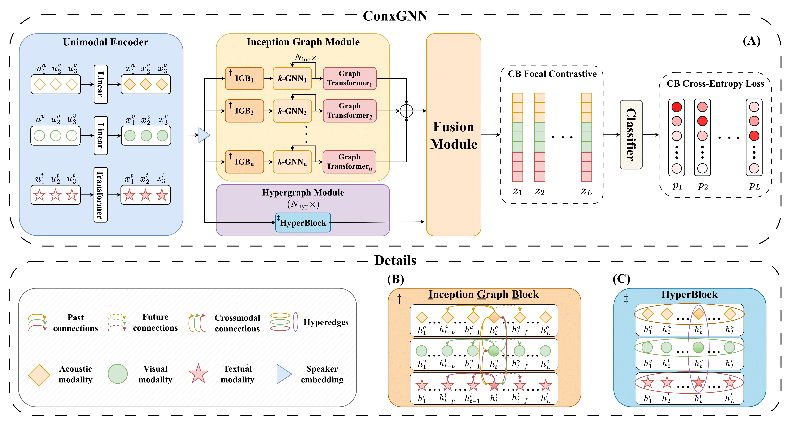

<div align="center">

# Effective Context Modeling Framework for Emotion Recognition in Conversations
</div>


## Table of Contents
- [Introduction](#introduction)
- [Installation](#installation)
- [Usage](#usage)
- [Acknowledgement](#acknowledgement)
- [Citation](#citation)

## Introduction
This is the official implementation of the paper *"Effective Context Modeling Framework for Emotion Recognition in Conversations"*. Our paper is published at **ICASSP 2025** 🎉.
<div align="center">
    
    <p>Figure: Detailed architecture of <b>(A)</b> the proposed ConxGNN, <b>(B)</b> Inception Graph Block, and <b>(C)</b> HyperBlock.</p>
</div>

## Installation
Install the dependencies:
```bash
 conda env create -f environment/environment.yml
```
Read [`environment/helper.txt`](./environment/helper.txt) if some libraries can't be installed.

## Usage
To train the model, run the following command:
```bash
python train.py configs/meld.yaml       # for MELD
python train.py configs/iemocap6.yaml   # for IEMOCAP
```

## Acknowledgement
Part of the code is borrowed from the following repositories. We would like to thank the authors for their great work.
- [MultiEMO](https://github.com/TaoShi1998/MultiEMO)
- [M3Net](https://github.com/feiyuchen7/M3NET)
- [CORECT](https://github.com/leson502/CORECT_EMNLP2023)

## Citation
If you find this work helpful, please consider citing our paper:
```bibtex
@misc{van2024effectivecontextmodelingframework,
      title={Effective Context Modeling Framework for Emotion Recognition in Conversations}, 
      author={Cuong Tran Van and Thanh V. T. Tran and Van Nguyen and Truong Son Hy},
      year={2024},
      eprint={2412.16444},
      archivePrefix={arXiv},
      primaryClass={cs.CL},
      url={https://arxiv.org/abs/2412.16444}, 
}
```